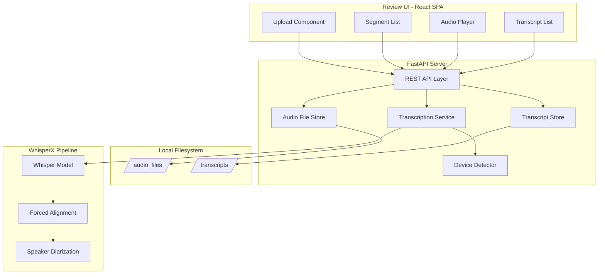
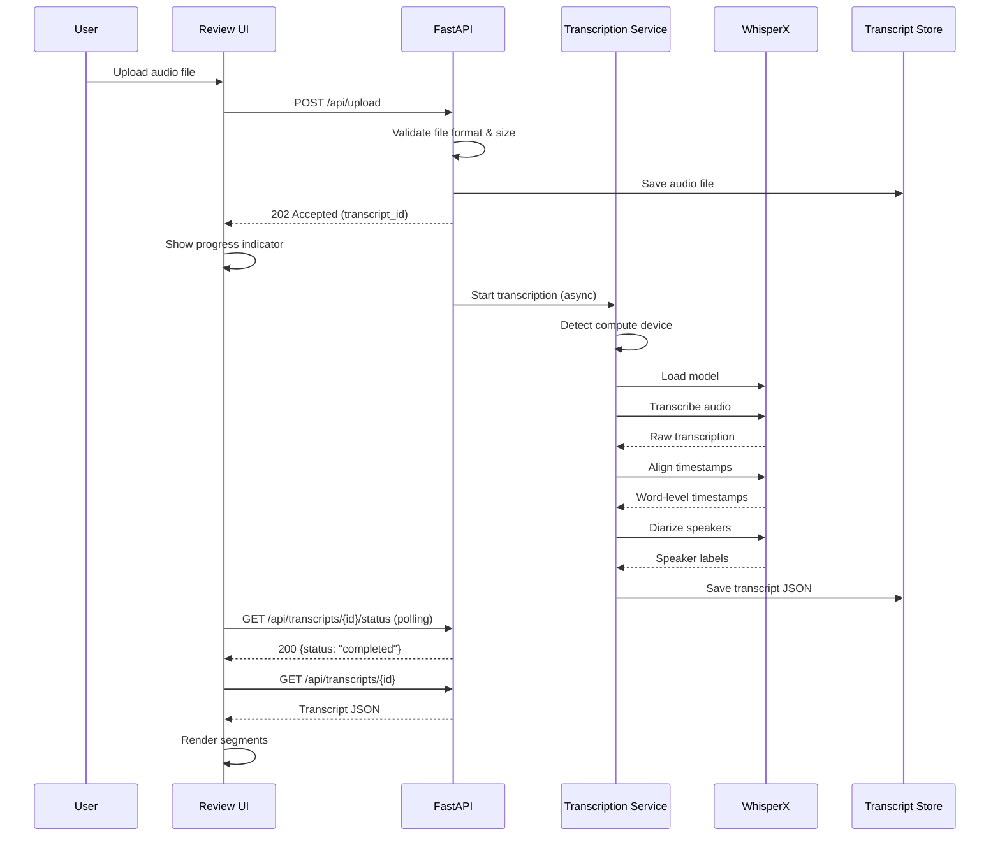

# Design Document: WhisperX Transcription Review

## Overview

This system is a single-user local application for transcribing audio files using WhisperX and reviewing the output in a web-based UI. The architecture follows a client-server model where a Python backend handles transcription, storage, and audio serving, while a browser-based frontend provides the review interface.

The backend exposes a REST API for file upload, transcription orchestration, transcript CRUD operations, and audio streaming. The frontend is a single-page application that communicates with the backend via HTTP. All data is stored locally on the filesystem as JSON files.

### Key Design Decisions

1. **Python + FastAPI backend**: WhisperX is a Python library, so the backend is Python-native. FastAPI provides async support and automatic OpenAPI documentation.
2. **React frontend with TypeScript**: Provides a component-based UI with strong typing for the segment data model.
3. **Filesystem-based storage**: No database needed for a single-user local tool. JSON files are human-readable and easy to debug.
4. **Compute device auto-detection**: The backend detects available hardware (MPS, CUDA, CPU) at startup and selects the optimal device.

## Architecture



### Request Flow



## Components and Interfaces

### Backend Components

#### 1. REST API Layer (`api/routes.py`)

| Endpoint | Method | Description |
|----------|--------|-------------|
| `/api/upload` | POST | Upload audio file, returns transcript_id |
| `/api/transcripts` | GET | List all transcripts |
| `/api/transcripts/{id}` | GET | Get full transcript with segments |
| `/api/transcripts/{id}/status` | GET | Get transcription status |
| `/api/transcripts/{id}` | PUT | Update transcript (edits, PII flags) |
| `/api/transcripts/{id}/audio` | GET | Stream audio file |

#### 2. Transcription Service (`services/transcription.py`)

```python
class TranscriptionService:
    def __init__(self, device: str, model_name: str = "large-v2"):
        """Initialize with detected compute device."""

    async def transcribe(self, audio_path: Path, transcript_id: str) -> TranscriptData:
        """Run full WhisperX pipeline: transcribe, align, diarize."""

    def detect_device(self) -> str:
        """Detect available compute device: 'cuda', 'mps', or 'cpu'."""
```

#### 3. Transcript Store (`services/store.py`)

```python
class TranscriptStore:
    def __init__(self, storage_dir: Path):
        """Initialize with base storage directory."""

    def save(self, transcript: TranscriptData) -> None:
        """Persist transcript as JSON file."""

    def load(self, transcript_id: str) -> TranscriptData:
        """Load transcript from JSON file."""

    def list_all(self) -> list[TranscriptSummary]:
        """List all stored transcripts with summary info."""

    def update_segment(self, transcript_id: str, segment_index: int, updates: SegmentUpdate) -> None:
        """Update a specific segment (edit text, PII flag)."""
```

#### 4. Device Detector (`services/device.py`)

```python
def detect_compute_device() -> tuple[str, str]:
    """
    Detect the best available compute device.
    Returns (device_name, description) e.g. ('cuda', 'NVIDIA GPU with CUDA')
    """
```

### Frontend Components

#### 1. Upload Component
- File picker with drag-and-drop support
- Displays file name and size before submission
- Format validation (WAV, MP3, FLAC, M4A)
- Progress indicator during transcription

#### 2. Segment List Component
- Renders segments in chronological order
- Color-coded speaker labels
- Inline edit mode for text correction
- PII toggle per segment
- Visual indicators for edited segments
- "Revert to original" action on edited segments

#### 3. Audio Player Component
- HTML5 audio element with custom controls
- Segment-click seeking (jumps to segment start time)
- Playback speed selector (1x, 1.5x, 2x)
- Current position indicator
- Active segment highlighting during playback

#### 4. Transcript List Component
- Lists all stored transcripts
- Shows file name, date, and review status
- Click to load a transcript for review

## Data Models

### TranscriptData (Primary JSON Structure)

```json
{
  "id": "uuid-string",
  "metadata": {
    "audio_file_name": "interview.wav",
    "audio_file_path": "audio_files/uuid/interview.wav",
    "transcription_date": "2024-01-15T10:30:00Z",
    "total_duration_seconds": 3600.5,
    "model_name": "large-v2",
    "device_used": "mps",
    "status": "completed"
  },
  "segments": [
    {
      "index": 0,
      "start": 0.0,
      "end": 4.52,
      "speaker": "SPEAKER_00",
      "text": "Hello, my name is John Smith.",
      "edited_text": null,
      "pii_flagged": true
    }
  ]
}
```

### Python Data Models

```python
from pydantic import BaseModel
from datetime import datetime
from enum import Enum

class TranscriptionStatus(str, Enum):
    PENDING = "pending"
    PROCESSING = "processing"
    COMPLETED = "completed"
    FAILED = "failed"

class Segment(BaseModel):
    index: int
    start: float
    end: float
    speaker: str
    text: str
    edited_text: str | None = None
    pii_flagged: bool = False

class TranscriptMetadata(BaseModel):
    audio_file_name: str
    audio_file_path: str
    transcription_date: datetime
    total_duration_seconds: float
    model_name: str
    device_used: str
    status: TranscriptionStatus

class TranscriptData(BaseModel):
    id: str
    metadata: TranscriptMetadata
    segments: list[Segment]

class SegmentUpdate(BaseModel):
    edited_text: str | None = None
    pii_flagged: bool | None = None

class TranscriptSummary(BaseModel):
    id: str
    audio_file_name: str
    transcription_date: datetime
    status: TranscriptionStatus
    segment_count: int
    pii_flagged_count: int
    edited_count: int
```

### TypeScript Interfaces (Frontend)

```typescript
interface Segment {
  index: number;
  start: number;
  end: number;
  speaker: string;
  text: string;
  edited_text: string | null;
  pii_flagged: boolean;
}

interface TranscriptMetadata {
  audio_file_name: string;
  audio_file_path: string;
  transcription_date: string;
  total_duration_seconds: number;
  model_name: string;
  device_used: string;
  status: "pending" | "processing" | "completed" | "failed";
}

interface TranscriptData {
  id: string;
  metadata: TranscriptMetadata;
  segments: Segment[];
}

interface SegmentUpdate {
  edited_text?: string | null;
  pii_flagged?: boolean;
}

interface TranscriptSummary {
  id: string;
  audio_file_name: string;
  transcription_date: string;
  status: string;
  segment_count: number;
  pii_flagged_count: number;
  edited_count: number;
}
```


## Correctness Properties

*A property is a characteristic or behavior that should hold true across all valid executions of a system—essentially, a formal statement about what the system should do. Properties serve as the bridge between human-readable specifications and machine-verifiable correctness guarantees.*

### Property 1: Unsupported format rejection

*For any* file with an extension not in the set {wav, mp3, flac, m4a}, the Transcription Service SHALL reject the upload and return an error message listing the supported formats.

**Validates: Requirements 1.3**

### Property 2: Segment timestamp invariant

*For any* segment produced by the transcription pipeline, the start timestamp SHALL be non-negative, the end timestamp SHALL be greater than the start timestamp, and each distinct speaker SHALL have a unique speaker identifier consistent across all their segments.

**Validates: Requirements 2.3, 2.4**

### Property 3: Segment display completeness

*For any* list of segments rendered in the Review UI, the segments SHALL appear in chronological order by start timestamp, and each segment SHALL display its speaker identifier, start timestamp, end timestamp, and transcribed text, with visually distinct identifiers assigned to different speakers.

**Validates: Requirements 3.1, 3.2, 3.3, 3.4, 3.5**

### Property 4: PII flag visual-state consistency

*For any* segment, the visual PII indicator SHALL be present if and only if the segment's pii_flagged value is true.

**Validates: Requirements 4.2, 4.3**

### Property 5: Segment edit display and indicator

*For any* segment where edited_text is non-null, the Review UI SHALL display the edited_text in place of the original text and SHALL show a visual edit indicator.

**Validates: Requirements 5.2, 5.4**

### Property 6: Edit revert restores original

*For any* segment with a non-null edited_text, reverting the edit SHALL restore the displayed text to the original text value and set edited_text to null.

**Validates: Requirements 5.5**

### Property 7: Transcript JSON structural completeness

*For any* valid TranscriptData object, the serialized JSON SHALL contain metadata fields (audio_file_name, transcription_date, total_duration_seconds) and each segment SHALL contain all required fields (start, end, speaker, text, pii_flagged, edited_text).

**Validates: Requirements 6.2, 6.3**

### Property 8: Transcript serialization round-trip

*For any* valid TranscriptData object, serializing to JSON and then deserializing SHALL produce an object equivalent to the original.

**Validates: Requirements 6.5, 6.4, 8.1**

### Property 9: PII and edit persistence round-trip

*For any* segment with any combination of pii_flagged value and edited_text value, saving the transcript and reloading it SHALL preserve both the pii_flagged state and the edited_text (along with the original text).

**Validates: Requirements 4.4, 4.5, 5.3**

### Property 10: Segment click seeks to correct time

*For any* segment in the transcript, clicking that segment SHALL set the audio playback position to the segment's start timestamp.

**Validates: Requirements 7.2**

### Property 11: Active segment highlighting matches playback position

*For any* playback position within the audio duration, the Review UI SHALL highlight exactly the segment whose time range (start <= position < end) contains that position.

**Validates: Requirements 7.6**

### Property 12: Transcript list displays required fields

*For any* transcript summary in the list view, the rendered output SHALL include the audio file name, transcription date, and review status.

**Validates: Requirements 8.4**

## Error Handling

### Backend Error Handling

| Error Scenario | Response | HTTP Status |
|---------------|----------|-------------|
| Unsupported file format | `{"error": "Unsupported format. Supported: WAV, MP3, FLAC, M4A"}` | 400 |
| File exceeds max size | `{"error": "File exceeds maximum size of {max_size}MB"}` | 413 |
| WhisperX model failure | `{"error": "Transcription failed: {reason}"}` | 500 |
| Transcript not found | `{"error": "Transcript {id} not found"}` | 404 |
| Invalid segment index | `{"error": "Segment index {idx} out of range"}` | 400 |
| JSON parse error on load | `{"error": "Corrupt transcript file: {details}"}` | 500 |
| Audio file missing | `{"error": "Audio file not found for transcript {id}"}` | 404 |

### Frontend Error Handling

- **Upload failures**: Display error message from backend, allow retry
- **Transcription failures**: Show error with failure reason, offer to re-upload
- **Network errors**: Show connection error toast, auto-retry on reconnect
- **Save failures**: Show save error, preserve local state, offer manual retry
- **Audio load failures**: Show message that audio is unavailable, allow transcript review without playback

### Device Detection Fallback Chain

```
1. Check for CUDA (torch.cuda.is_available()) → use 'cuda'
2. Check for MPS (torch.backends.mps.is_available()) → use 'mps'
3. Fall back to 'cpu' → warn user about slower processing
```

## Testing Strategy

### Property-Based Tests (fast-check for TypeScript, Hypothesis for Python)

Property-based testing is appropriate for this feature because:
- The data model (TranscriptData, Segments) has clear structural invariants
- Serialization/deserialization has a natural round-trip property
- UI rendering logic has universal properties (display correctness for all inputs)
- Input validation has clear accept/reject boundaries

**Configuration:**
- Minimum 100 iterations per property test
- Each test tagged with: `Feature: whisperx-transcription-review, Property {N}: {title}`

**Python (Hypothesis):**
- Property 1: Format validation rejection
- Property 2: Segment timestamp invariants
- Property 7: JSON structural completeness
- Property 8: Serialization round-trip
- Property 9: Persistence round-trip

**TypeScript (fast-check):**
- Property 3: Segment display completeness
- Property 4: PII flag visual-state consistency
- Property 5: Edit display and indicator
- Property 6: Edit revert
- Property 10: Segment click seeking
- Property 11: Active segment highlighting
- Property 12: Transcript list display

### Unit Tests (pytest for Python, Vitest for TypeScript)

- Device detection logic (mock torch backends)
- File size validation boundary cases
- Error message formatting
- Transcript status transitions
- Audio player speed control behavior
- Specific UI interaction flows (upload, edit, save)

### Integration Tests

- Full transcription pipeline with a short test audio file (mocked WhisperX)
- Transcript store file I/O (create, read, update, list)
- API endpoint integration (upload → transcribe → retrieve → update)
- Audio streaming endpoint

### Manual Testing

- Cross-platform device detection (macOS MPS, Windows CUDA, CPU fallback)
- Audio playback quality at different speeds
- Visual design review (speaker color coding, PII indicators, edit indicators)
- Accessibility (keyboard navigation, screen reader compatibility)
